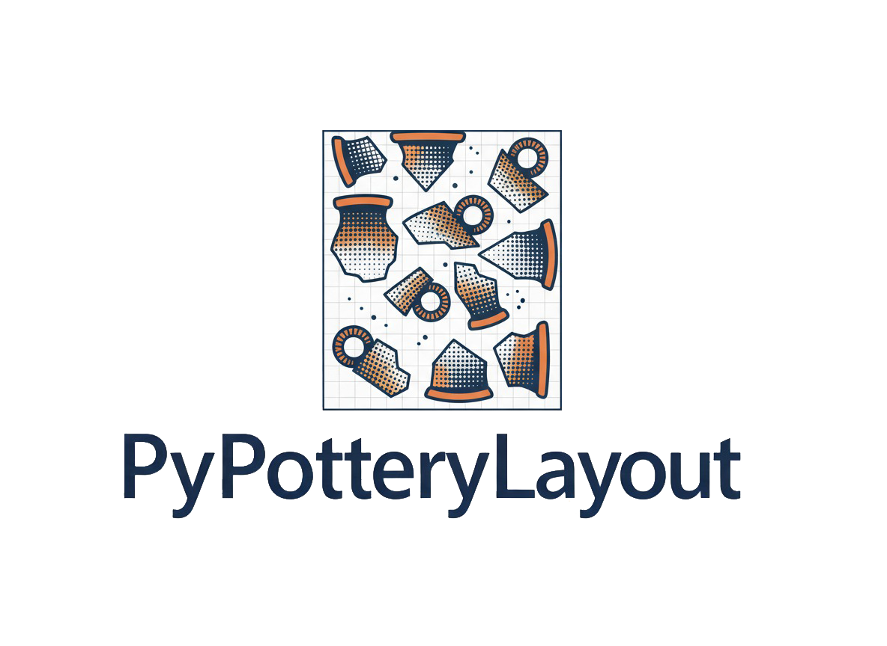
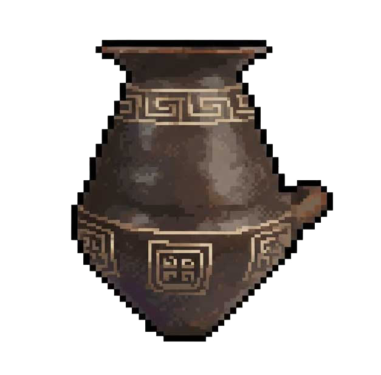

# PyPotteryLayout

<div align="center">



[](https://www.python.org/downloads/)
[](LICENSE) 
[](https://github.com/lrncrd/PyPotteryLayout)

Create artefacts table effortless

</div>


## Introduction

Producing publication-quality catalogues of archaeological artefacts is often a time-consuming process, requiring both precision in presentation and consistency across large datasets. **PyPotteryLayout** is designed to streamline this workflow by combining automation with professional publishing standards.

Instead of manually arranging artefact images, adjusting captions, and aligning scale bars, researchers can generate layouts in minutes while retaining full control over the final output. The software produces clean, publication-ready figures that meet the expectations of academic journals, site reports, and edited volumes. Its vector-based exports (SVG) ensure that images, scale bars, and captions remain sharp and editable at any stage of the editorial process.

This efficiency makes the tool particularly valuable for projects with large assemblages, where hundreds of objects must be documented quickly without sacrificing visual quality. At the same time, the flexibility of SVG editing allows archaeologists and illustrators to refine details, translate captions, or adjust layouts for specific publication styles.


## 🏺 Features

### Core Functionality
- **Automatic Layout Generation**: Grid-based and optimized puzzle layouts
- **Multi-Format Export**: SVG, PDF and JPG
- **Effortless Output**: Quick export with minimal clicks
- **Metadata Integration**: Excel/CSV metadata support for captions and sorting
- **Flexible Sorting**: Multiple sorting options including custom metadata fields

### Advanced Layout Options
- **Grid Layout**: Customizable rows and columns with precise control
- **Puzzle Layout**: Optimized space utilization algorithm
- **Scale Bars**: Automatic generation with customizable measurements
- **Caption System**: Editable text with metadata integration
- **Margin Management**: Professional borders and spacing controls

## 🚀 Quick Start

### Download & Run (Windows) - Web Version

<div align="center">



</div>

1. Download `PyPotteryLayout.exe` from [Releases](../../releases)
2. Double-click to run - **no installation required**
3. Your default browser will open automatically
4. Upload images, configure layout, and export
5. Close the browser when finished

> **Note**: The executable runs a local web server. All processing happens on your computer - no internet connection required after download.

### Run from Source (All Platforms)

#### Web Interface (Flask)
```bash
# Clone repository
git clone https://github.com/lrncrd/PyPotteryLayout.git
cd PyPotteryLayout

# Install dependencies
pip install -r requirements.txt

# Option 1: Run with launcher (recommended)
python flask_launcher.py

# Option 2: Run Flask directly
python app.py
# Then open http://127.0.0.1:5005 in your browser
```

#### Desktop GUI (Alternative)
```bash
# Install dependencies
pip install -r requirements.txt

# Run desktop application
python gui_app.py
```

## 📋 System Requirements

### Standalone Executable (Windows)
- **Operating System**: Windows 10/11
- **Memory**: 2GB+ RAM recommended
- **Browser**: Any modern browser (Chrome, Edge, Firefox)
- **No Python installation required!**

### Running from Source
- **Python**: 3.11+ 
- **Operating System**: Windows/macOS/Linux
- **Memory**: 2GB+ RAM recommended for large image sets
- **Dependencies**: See `requirements.txt`
  - Flask (web version)
  - PIL/Pillow (image processing)
  - openpyxl (Excel support)
  - rectpack (puzzle layout algorithm)

## 🎯 Usage Guide

### Basic Workflow (Web Interface)
1. **Upload Images**: Drag & drop or select pottery images
2. **Configure Layout**: Choose grid or puzzle layout with dimensions
3. **Add Metadata** (Optional): Upload Excel/CSV file with captions and sorting
4. **Customize Settings**: 
   - Scale and margins
   - Caption formatting
   - Scale bars
   - Image sorting
5. **Preview**: Check the layout before exporting
6. **Export**: Download as SVG, PDF, or ZIP with all files

### Basic Workflow (Desktop GUI)
1. **Select Images**: Choose folder containing pottery images
2. **Configure Layout**: Set grid dimensions or use puzzle optimization
3. **Add Metadata**: Optional Excel file with captions and sorting data
4. **Customize Output**: Scale, margins, captions, scale bars
5. **Export**: Choose SVG for editing or PDF for publication

### Metadata Format

Excel/CSV files should have:
- First column: Image filenames (with extensions)
- Additional columns: Custom data for captions and sorting

```
Filename    | Site     | Period  | Description
IMG001.jpg  | Site A   | Roman   | Storage jar
IMG002.jpg  | Site B   | Medieval| Bowl fragment
```
NB: Filenames must match exactly (case-sensitive), **including extensions**.

## 🔧 Advanced Features

### Building Executable from Source

Want to create your own standalone executable?

```bash
# Install PyInstaller
pip install pyinstaller

# Build the executable
python build_exe.py

# Find your exe in dist/ folder
# dist/PyPotteryLayout.exe
```

The build script automatically:

- Includes all templates and static files
- Bundles Flask and dependencies
- Adds custom icon
- Creates no-console launcher

### SVG Editing Workflow
1. Export as SVG format
2. Open in Inkscape (free, recommended)
3. Edit text, move objects, adjust colors
4. Keep `images/` folder next to SVG file
5. All elements remain fully editable

### Output Files Location

**Standalone Executable**: Files are saved next to the *.exe*:

- `uploads/` - Temporary uploaded images
- `outputs/` - Generated layouts and exports
- `pypotterylayout.log` - Application logs (for debugging)

**From Source**: Files are saved in the project directory


## 📊 Recent Updates

### v0.3.0

- **New features**:
  - Improved SVG export
  - Data handling optimizations
  - Upgraded preview rendering


### v0.2.0 (Flask Web Version)

- **New Web Interface**: Modern browser-based UI
- **Standalone Executable**: Windows .exe with no dependencies
- **Drag & Drop Upload**: Easy image management
- **Live Preview**: See layout before exporting
- **Download Manager**: Get results as ZIP or individual files
- **Improved Paths**: Files saved next to executable for easy access
- **Custom Icon**: Professional app branding

### v0.1.1

- Improved SVG export quality (all elements are now editable)
- Added option to show table numbering
- Added Masonry layout option (experimental)
- Added preview of layout in GUI

### v0.1.0

- First public release with core features

## 🎯 Future Plans

If you have suggestions or need help, please open an issue on GitHub!


## 👥 Contributors

<a href="https://github.com/lrncrd/PyPotteryLayout/graphs/contributors">
  
</a>

---

Developed with ❤️ by [Lorenzo Cardarelli](https://github.com/lrncrd)
