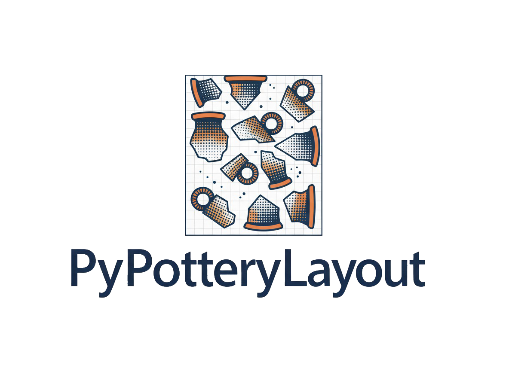

# PyPotteryLayout

<div align="center">



[](https://www.python.org/downloads/)
[](https://lrncrd.github.io/PyPottery/community.html)
[](https://github.com/lrncrd/PyPotteryLayout)

Create artefacts table effortless

</div>

---

## Introduction

Producing publication-quality catalogues of archaeological artefacts is often a time-consuming process, requiring both precision in presentation and consistency across large datasets. **PyPotteryLayout** is designed to streamline this workflow by combining automation with professional publishing standards.

Instead of manually arranging artefact images, adjusting captions, and aligning scale bars, researchers can generate layouts in minutes while retaining full control over the final output. The software produces clean, publication-ready figures that meet the expectations of academic journals, site reports, and edited volumes. Its vector-based exports (SVG) ensure that images, scale bars, and captions remain sharp and editable at any stage of the editorial process.

## ✨ Features

- **Automatic Layout Generation**: Grid-based and optimized puzzle layouts
- **Multi-Format Export**: SVG, PDF and JPG
- **Metadata Integration**: Excel/CSV metadata support for captions and sorting
- **Flexible Sorting**: Multiple sorting options including custom metadata fields
- **Scale Bars**: Automatic generation with customizable measurements
- **Caption & Numbering System**: Editable captions with table/object numbering options
- **Margin Management**: Professional borders and independent spacing controls

## 🚀 Quick Start

### Option 1 — PyPottery Suite Launcher (recommended)

The easiest way to get started, no Python installation required.

<p align="center">
  <a href="https://github.com/lrncrd/PyPottery/releases/latest">
    
  </a>
</p>

1. Grab the installer for your OS from [Releases](https://github.com/lrncrd/PyPottery/releases/latest)
2. Run it (Windows) or drag-to-Applications (macOS) — no Python install required
3. Launch PyPotteryLayout from the suite launcher; updates are handled automatically

### Option 2 — Manual installation (from source)

For developers, or anyone who wants to run the app on its own:

```bash
# Clone repository
git clone https://github.com/lrncrd/PyPotteryLayout.git
cd PyPotteryLayout

# Install dependencies
pip install -r requirements.txt

# Run the app
python app.py
# Then open http://127.0.0.1:5005 in your browser
```

## 📋 System Requirements

- **Python**: 3.12 (tested)
- **Operating System**: Windows/macOS/Linux
- **Memory**: 2GB+ RAM recommended for large image sets
- **Dependencies**: See `requirements.txt` (Flask, Pillow, openpyxl, rectpack)

## 🎯 Usage

1. **Upload Images**: Drag & drop or select pottery images
2. **Add Metadata** (optional): Upload an Excel/CSV file with captions and sorting fields — the first column must be the image filename (extension and case are ignored)
3. **Configure Layout**: Choose grid or puzzle layout, margins, spacing, scale bars and numbering
4. **Preview & Export**: Check the layout, then export as SVG (fully editable in Inkscape), PDF or JPG

For the full walkthrough, see the **[Usage Guide](https://lrncrd.github.io/PyPottery/pypotterylayout/usage.html)**.

## 📊 What's New

See the **[Version History](https://lrncrd.github.io/PyPottery/pypotterylayout/version_history.html)** for the full changelog.

## 👥 Contributors

<a href="https://github.com/lrncrd/PyPotteryLayout/graphs/contributors">
  
</a>

## ☕ Support This Project

If you find PyPotteryLayout useful for your research, consider supporting its development:

[](https://ko-fi.com/lrncrd)

Your support helps maintain and improve this open-source tool for the archaeological community!

---

Developed with ❤️ by [Lorenzo Cardarelli](https://github.com/lrncrd)
